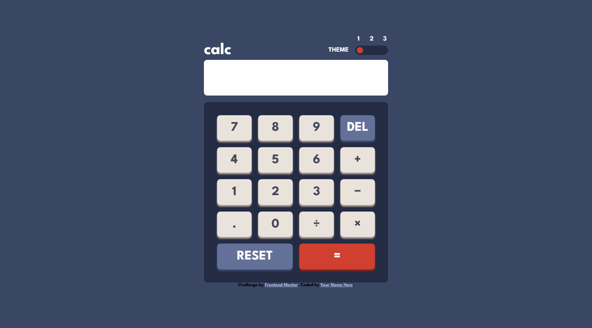
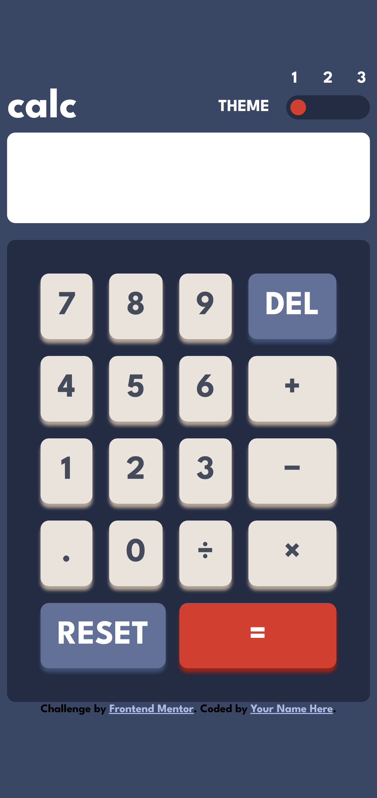

# Frontend Mentor - Calculator app solution

This is a solution to the [Calculator app challenge on Frontend Mentor](https://www.frontendmentor.io/challenges/calculator-app-9lteq5N29). Frontend Mentor challenges help you improve your coding skills by building realistic projects.

## Table of contents

- [Overview](#overview)
  - [The challenge](#the-challenge)
  - [Screenshot](#screenshot)
  - [Links](#links)
- [My process](#my-process)
  - [Built with](#built-with)
  - [What I learned](#what-i-learned)
  - [Continued development](#continued-development)
  - [Useful resources](#useful-resources)

**Note: Delete this note and update the table of contents based on what sections you keep.**

## Overview

### The challenge

Users should be able to:

- See the size of the elements adjust based on their device's screen size `done`
- Perform mathmatical operations like addition, subtraction, multiplication, and division `done`
- Adjust the color theme based on their preference `done`
- **Bonus**: Have their initial theme preference checked using `prefers-color-scheme` and have any additional changes saved in the browser

### Screenshot

### Links

- [Solution URL: ](https://github.com/TechNech/calculator-app-FM)
- [Live Site URL: ](https://technech.github.io/calculator-app-FM/)

## My process

### Built with

- Semantic HTML5 markup
- SASS (SCSS)
- CSS Grid
- Flexbox
- Vanilla JS

### What I learned

This was a good challenge to take on as I learned alot about JavaScript.

### Continued development

- Formatting the calculator result in the display.

### Useful resources

- [Resource 1](https://github.com/Fernando0654/FEM_4_Calculator_App) - This helped me for the theme switching using CSS and JS. I really liked this pattern and will use it going forward.
- [Resource 2](https://developer.mozilla.org/en-US/docs/Web/JavaScript/Reference/Global_Objects/String/slice) - This helped me in the `DEL` button as it was just only one line of code.
